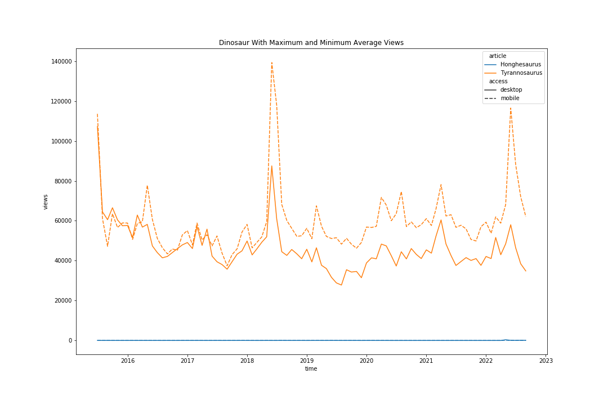
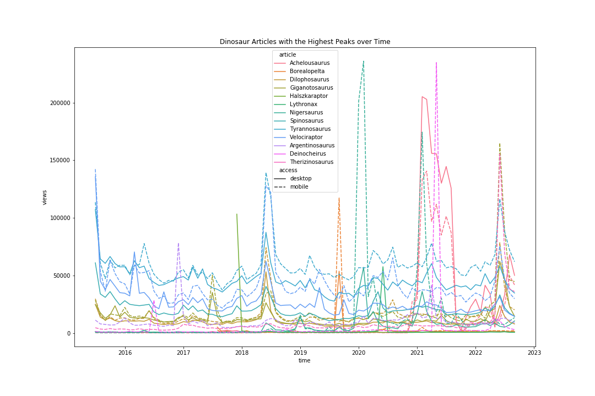
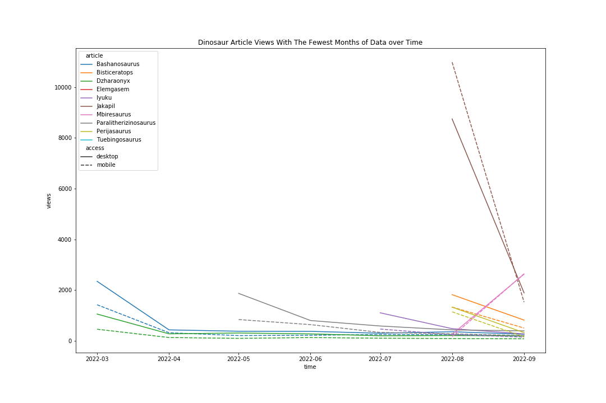

# DATA512 Homework 1

## Project Goal
The goal of this project is to practice writing code that is reproducible. After reading the articles *Assessing Reproducibility* and *The Basic Reproducible Workflow Template* we are tasked with applying the knowledge we gained from the articles into a real world example.

## Project Description
For this project we use the WikiMedia REST API to gather data about pageviews for Wikipedia articles about dinosaurs and store this data as a json file. After the data is stored, we perform analysis on this data by creating three different visualizations using the data we gathered

## Project Files
Input Files
- dinosaur_genera.cleaned.SEPT.2022 - dinosaur_genera.cleaned.SEPT.2022.csv
  - CSV downloaded from excel file given in homework instructions. Gives us article titles and wikipedia link

The JSON files outputted by this project are listed below. All the following json files has the article name as the key and project, article, granularity, timestamp, agent and views for each month as the value:
- dino_monthly_desktop_201507-202209.json
  - Data for each dinosaur by month for desktop access
- dino_monthly_mobile_201507-202209.json
  - Data for each dinosaur by month for mobile access. This includes both mobile app and mobile web access
- dino_monthly_cumulative_201507-202209.json
  - Data for each dinosaur by month for all access types
  
*Note:* When collecting the data if there exists a dinosaur that has no article views between the given time period that article title is ommited from the final json file
  
 The graphs outputted by this project are shown below:
 
 This graph shows the pageviews over time for the articles with the highest and lowest average views by access type. As seen above, Tyrannosaurus has the highest average views and Honghesaurus has the lowest average views.
 
 
 This graph shows the pageviews over time for the articles that have the highest peaks in their pageviews by access type.
 
  
This graph shows a time series of pageviews for the articles that have the lowest amount of months with data. There are some lines that don't start until halfway through the graph, this indicated this article has 0 pageviews prior to that month
  
## Project Sources and Licenses
[Source Data License]('www.gnu.org/licenses/fdl-1.3.html')

[Wikimedia Foundation REST API terms of use]('www.mediawiki.org/wiki/REST_API#Terms_and_conditions')

[Pageviews API Documentation]('wikitech.wikimedia.org/wiki/Analytics/AQS/Pageviews')

[Pageviews API Endpoint]('wikimedia.org/api/rest_v1/#!/Pageviews_data/get_metrics_pageviews_aggregate_project_access_agent_granularity_start_end')

